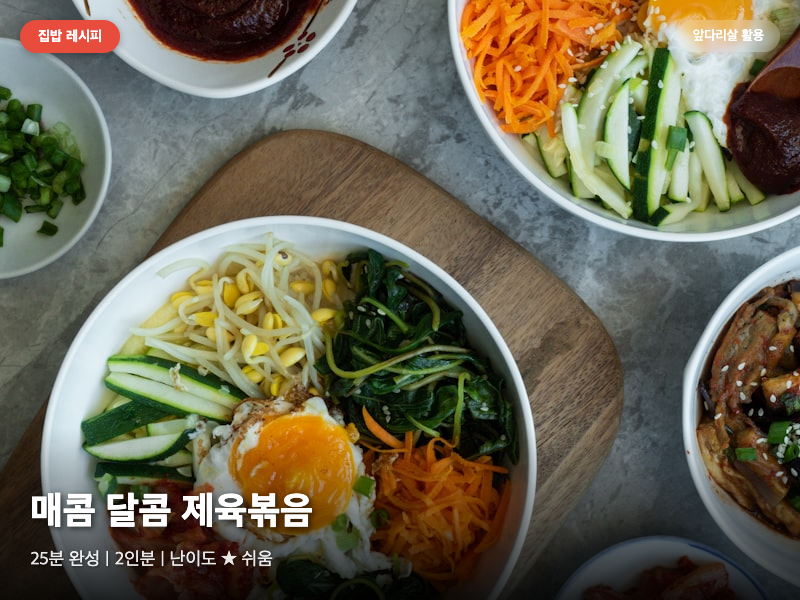

# 제육볶음 (앞다리살)

## 요약
- 소요시간: 25분
- 난이도: 쉬움
- 분량: 2인분

## 재료

### 주재료
- 돼지고기 앞다리살: 400g
- 양파: 1개 (중간 크기)
- 대파: 1대
- 청양고추: 1개 (선택)
- 깻잎: 5장 (선택)

### 양념
- 고추장: 2큰술
- 고춧가루: 1큰술
- 간장: 2큰술
- 설탕: 1큰술
- 다진 마늘: 1큰술
- 생강즙: 1/2작은술 (또는 생강가루 약간)
- 맛술(미림): 1큰술
- 참기름: 1큰술
- 후추: 약간

## 만드는 법

1. 돼지고기 앞다리살을 한입 크기로 얇게 썬다. 너무 두꺼우면 양념이 잘 배지 않으니 0.5cm 정도 두께가 적당하다.

2. 양념 재료(고추장, 고춧가루, 간장, 설탕, 다진 마늘, 생강즙, 맛술, 참기름, 후추)를 볼에 넣고 잘 섞어 양념장을 만든다.

3. 썬 돼지고기에 양념장의 절반을 넣고 손으로 조물조물 버무린다. 최소 10분 이상 재워두면 맛이 훨씬 좋다. 시간이 있으면 냉장고에서 30분 정도 재운다.

4. 양파는 채 썰고, 대파는 어슷 썰고, 청양고추는 송송 썬다.

5. 팬에 식용유를 약간 두르고 센 불에서 달군다. 팬이 충분히 뜨거워지면 재워둔 고기를 넣는다.

6. 고기를 처음 1분 정도는 건드리지 않고 그대로 둔다. 센 불에서 겉면이 살짝 캐러멜화되면 뒤집는다.

7. 고기가 반 정도 익으면 양파를 넣고 함께 볶는다. 남은 양념장도 이때 추가한다.

8. 양파가 투명해지면 대파와 청양고추를 넣고 1분 정도 더 볶는다.

9. 불을 끄고 깻잎을 손으로 찢어 올린다. 밥 위에 얹어 먹으면 완성.

## 꿀팁
- 앞다리살은 지방이 적당히 있어서 제육볶음에 가장 잘 어울리는 부위다. 목살보다 저렴하면서도 식감이 좋다.
- 고기를 볶을 때 절대 물을 넣지 않는다. 센 불에서 빠르게 볶아야 수분이 날아가면서 맛이 응축된다.
- 양념에 배즙이나 사과즙을 1큰술 넣으면 고기가 더 부드러워진다.
- 볶을 때 한 번에 너무 많은 양을 넣으면 고기가 볶아지는 게 아니라 삶아진다. 팬에 고기가 겹치지 않도록 넣는다.
- 남은 제육볶음은 볶음밥, 김밥, 샌드위치에 활용하면 좋다.

## 재료 대체 옵션
- 앞다리살 대신 목살이나 삼겹살도 가능하다. 목살은 더 부드럽고, 삼겹살은 더 기름지다.
- 고추장이 없으면 된장 1큰술 + 고춧가루 2큰술로 대체할 수 있다.
- 맛술 대신 청주나 소주 1큰술을 넣어도 된다.
- 생강즙이 없으면 생강가루 한 꼬집으로 대체한다.
- 설탕 대신 물엿 1큰술이나 매실원액 1큰술로 대체하면 깊은 단맛이 난다. 매실원액은 잡내 제거에도 효과적이다.
- 매운 것을 못 먹는다면 청양고추를 빼고 고춧가루를 반으로 줄인다.
