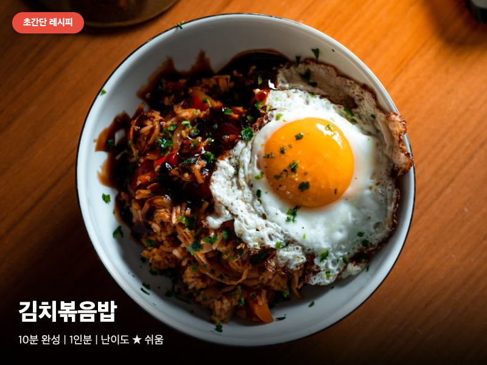

# 김치볶음밥

> ⏱️ 조리시간: 10분 | 🍽️ 1인분 | 난이도: ⭐ 쉬움

## 📝 재료
- 묵은 김치 — 1컵 (약 200g, 잘 익은 게 맛있어요)
- 스팸 — 1통 (200g, 깍둑썰기)
- 밥 — 1공기 (200g, 찬밥이면 더 좋아요!)
- 달걀 — 1개
- 고춧가루 — 1큰술
- 식용유 — 1큰술
- 간장 — 1/2큰술
- 설탕 — 1/2작은술
- 참기름 — 1/2작은술 (선택)
- 김치 국물 — 1~2큰술

## 👨‍🍳 만드는 법
1. 김치를 가위로 먹기 좋은 크기로 잘라둡니다. (도마 없이 그릇에서 바로 잘라도 돼요!)
2. 스팸 1통을 깍둑썰기로 잘라둡니다.
3. 팬에 식용유를 두르고 중불에서 **김치를 먼저** 넣고 2~3분간 볶아줍니다. (김치의 수분이 날아가면서 맛이 진해져요!)
4. 고춧가루 1큰술을 넣고 김치와 함께 30초 정도 더 볶아 색과 매운맛을 냅니다.
5. 깍둑썰기한 스팸을 넣고 겉면이 노릇해질 때까지 1~2분 볶습니다.
6. 밥을 넣고 주걱으로 김치, 스팸과 잘 섞으면서 볶습니다.
7. 김치 국물, 간장, 설탕을 넣고 고루 섞어가며 2~3분 더 볶습니다.
8. 팬 한쪽에 밥을 밀어두고 빈 자리에 달걀 프라이를 만듭니다.
9. 불을 끄고 참기름을 살짝 두르면 완성입니다!

## 💡 꿀팁
- 찬밥을 사용하면 볶음밥이 훨씬 잘 풀려요. 갓 지은 밥은 뭉칠 수 있어요.
- 달걀은 볶음밥과 함께 스크램블로 섞어도 맛있어요. 취향대로 선택하세요!
- 설거지 최소화: 팬 하나로 밥과 달걀 모두 조리하면 팬 1개만 씻으면 끝!
- 김치 대신 파김치나 깍두기를 써도 맛있어요.
- 스팸은 기름 없이 팬에 먼저 노릇하게 구워서 넣으면 식감이 더 좋아요.
- 고춧가루는 김치와 함께 볶아야 기름에 색이 배면서 맛이 깊어져요.
- 간이 부족하면 간장을 조금씩 추가하고, 더 매운맛을 원하면 고추장을 1/2큰술 넣어보세요.
