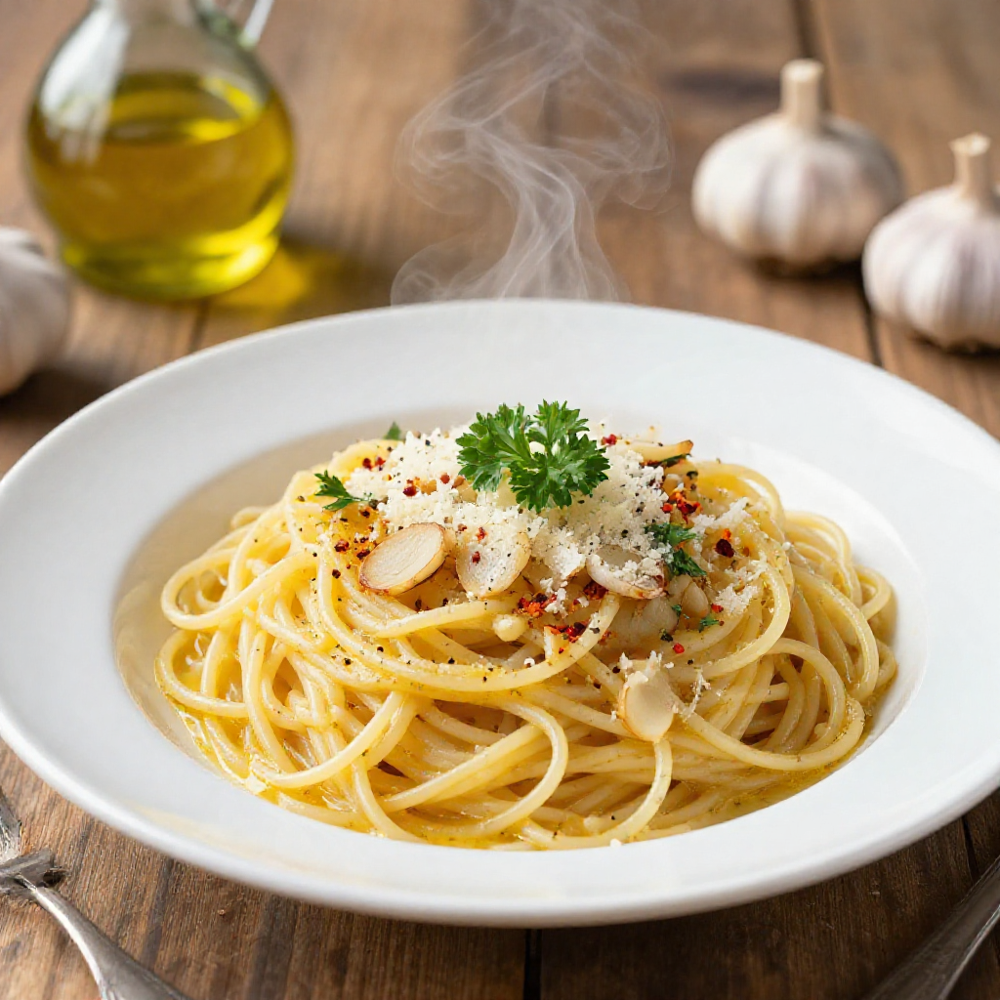

# 갈릭버터파스타

> 조리시간: 15분 | 1인분 | 난이도: 별 쉬움

## 재료
- 스파게티면 — 100g
- 버터 — 2큰술
- 마늘 — 4~5쪽
- 파슬리(또는 쪽파) — 약간
- 소금 — 적당량
- 후추 — 적당량
- 파마산 치즈 가루 — 취향껏 (없어도 괜찮아요!)

## 만드는 법
1. 냄비에 물을 넉넉히 붓고 소금 한 꼬집을 넣은 뒤 끓여주세요.
2. 물이 끓으면 스파게티면을 넣고 봉투에 적힌 시간보다 1분 덜 삶아요. 면수 한 컵은 버리지 말고 따로 둬요!
3. 면을 삶는 동안 마늘을 얇게 저며 썰어두세요.
4. 달군 팬에 버터를 녹이고, 마늘을 넣어 약불에서 노릇해질 때까지 볶아요. (1~2분이면 충분해요!)
5. 삶은 면을 팬에 넣고, 면수를 2~3큰술 추가해서 잘 섞어주세요. 면수가 소스를 부드럽게 만들어줘요.
6. 소금, 후추로 간을 맞추고, 파슬리나 쪽파를 뿌려서 마무리하면 끝!

## 꿀팁
- 마늘은 약불에서 천천히 볶아야 타지 않고 고소해요. 센불에서 볶으면 금방 쓴맛이 나니 주의하세요!
- 면수를 꼭 활용하세요. 소스가 너무 뻑뻑하거나 적으면 면수를 조금씩 추가하면 딱 맞는 농도가 나와요.
- 설거지 줄이기 팁: 면을 삶은 냄비를 씻지 말고 바로 소스 팬으로 활용하면 그릇 하나 줄일 수 있어요.
- 버터 대신 올리브오일을 써도 맛있어요. 혹은 반반 섞으면 더 풍부한 맛이 나요.
- 파마산 치즈가 없으면 그냥 먹어도 충분히 맛있어요. 슬라이스 치즈 한 장을 올려도 잘 어울려요!
